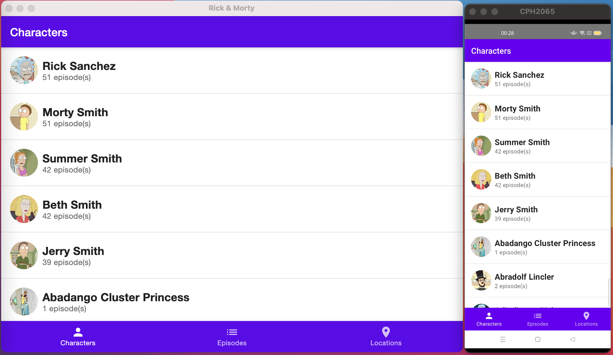

# Rick&Morty with Compose Multiplatform (Android/Desktop)

A copycat of https://github.com/joreilly/MortyComposeKMM to support Android & JVM with Jetpack Compose Multiplatform.

Big thanks to [@joreilly](https://github.com/joreilly) for all the amazing open source projects, articles and talks!

### Some technical notes

- paging is a bit laborious in desktop
- image loading on desktop is not cached
- UI has been split by platform, due to navigation being android only for now

